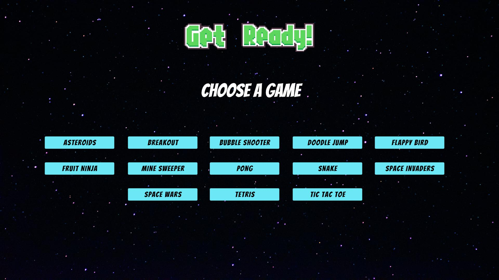

# Mini games in Unity

Hey there. This Repo will show you 13 well-known mini-games I've programmed.
Some of them are visually still rustic as my main goal was to implement the core mechanic of each game.

Each game has either a Pause Menu, accessible via esc, or a Game Over/Won Panel that occurs after the game ends.

## How to play: 

**Astroids**
- Shoot = space bar
- Movement = w,a,s,d

**Breakout**
- Movement = left and right arrows

**BubbleShooter**
- Shoot = left mouse key

**Doodle Jump**
- Movement = a for left, d for right

**Flappy Bird**
- Jump = space bar

**Fruit Ninja**
- Movement = mouse
- Slice = hold left mouse key

**Mine Sweeper**
- Click = left mouse key

**Tetris**
- Move pieces on x-axis = a, d
- Rotate pieces clockwise = q
- Rotate pieces counter-clockwise = e

**TicTacToe**
- Click = left mouse key

**Pong**
- Movement = w,s

**Snake**
- Movement = w,a,s,d

**Space Invaders**
- Movement = a,d
- Shoot = space bar

**Space Wars**
- Movement = w,s
- Shoot = left mouse key

